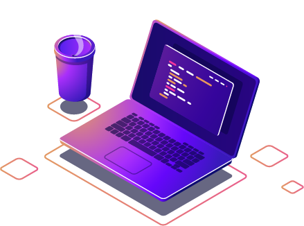

<h2 align="center"> Hi there, I'm <a href="https://www.linkedin.com/in/ayanadinesh/"> AYANA DINESH</a> </h2>

  
  ### 💻 Full-Stack Developer | 🚀 Software Engineer | 🧑‍💻 Freelancer

 
   

-  💻  Full-Stack Developer (MERN Stack) 
- 🎓 BSW Graduate from St. Joseph's College (Autonomous), Irinjalakuda  
- 🚀 Building scalable, high-performance web apps 
- 📚 Exploring new tools, frameworks, and technologies 
- 🌐 Blending tech with social insight  
- 🎨 UI/UX Designer crafting intuitive experiences  
- 🤝 Teamwork. Collaboration. Knowledge-sharing. 
- 💼 Open to collaborate on Projects & Freelance Works 

   
---

<h2 align="center">⚙️ Tech Stack Skills</h2>

<!-- ---

  <h2>💡 Futured Projects</h2>
<table align="center">
  <tr>
    <td><strong>My Portfolio Website</strong></td>
    
  <td>
      
      
    </td>
  </tr>
  <tr>
    <td><strong>Netflix Clone</strong></td>
    
  <td>
      
      
    </td>
  </tr>
</table>

 -->

---

<h2 align="center"> My Stats 🚀</h2>

## Current GitHub Stats 📊 

<a  href="https://github.com/codewithayana">

</a>

  
More stats

<!-- ## 🧑🏻‍💻Leetcode Stats

 -->

## 🏆 GitHub Trophies

  

 

  <em>Feel free to reach out or check out my repositories! Let's innovate together..! 🚀</em>

---

